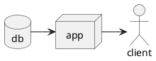

# MobShop

Collaborative shopping list

---

This document describes the [Features](#Features) and [Architecture](#Architecture) of the app to be developed.

See [README](../README.md) for an outline of the app.

---

##Features


## Architecture


```kotlin
val dataSource: MobShopItems() {
}
```




